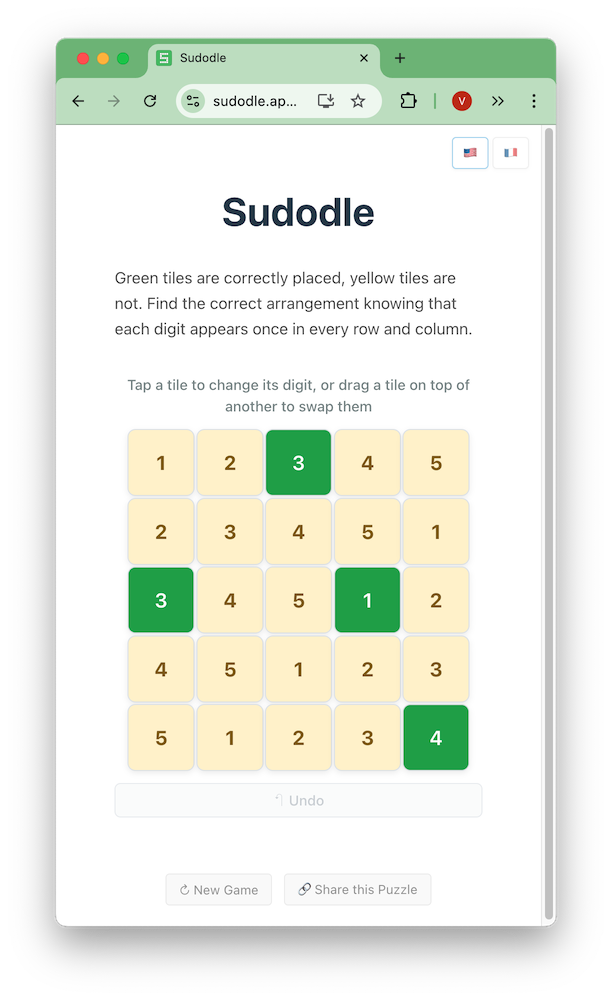

# Sudodle

In Sudodle, the player must find a square where each digit appears once on each row and column, given some well-placed values (in green) and incorrectly-placed values (in yellow).



## Repository Structure

This project is organized into two folders:

- **`puzzle_generation/`** - Scripts to study and generate puzzles.
  - Optimized Rust scripts to mine new puzzles reasonably fast (particularly useful for Sudodles of size 7 and above)
  - Python scripts and notebooks t analyze the game, attribute difficulty levels to puzzles, plot puzzles into the [puzzle book](./study/sudodles_puzzle_book.pdf)
- **`sudodle/`** - The web application [sudodle.app](https://sudodle.app), with thousands of puzzles and a multi-turn game mode

## Running the web app for development

Run the web applocally with 

```bash
npm install
npm run dev
```

The project is deployed on GitHub Pages from the `main` branch.
